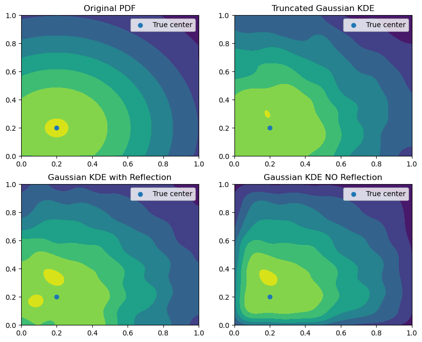
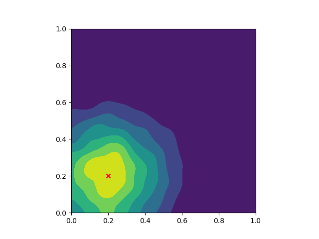

# truncnormkde
 Implements boundary-unbiased kde's in JAX that do not impose a zero derivative at the boundary

 Here is a comparison. It does alright.



## Usage
Evaluate the KDE by instantiating the `BoundedKDE` object

```python
from truncnormkde import compute_bandwidth, BoundedKDE

#Bounds and bandwidth
a = jnp.array([0.0, 0.0])
b = jnp.array([1.0, 1.0])
bandwidth = compute_bandwidth(X)

BKDE = BoundedKDE(a=a, b=b, bandwidth=bandwidth)
```

#### Evaluate
To evaluate it, just use it like a function:
```python
BKDE(evaluation_points, data_points)
```
> __Important:__ The last index for the `evaluation_points` and  `data_points` should be the dimension index. 

#### Gram Matrix
or compute the kernel gram martrix from a bunch of points by:
```python
BKDE.gram_matrix(data_points)
```

### Example:

Let's first generate some data
```python
import numpy as np

# Generate 8000 from truncated normal
import scipy

mu=0.1; sig=0.1; a=0; b=1;
X = jnp.stack([scipy.stats.truncnorm.rvs(loc=mu, scale=sig, a=(a - mu)/sig, b=(b-mu)/sig, size=800)
           ,scipy.stats.truncnorm.rvs(loc=mu, scale=sig, a=(a - mu)/sig, b=(b-mu)/sig, size=800)]).T

X.shape # (8000, 2) # Important that the dimension of the space is the last index
```

then evaluate it on a grid:

```python
# Generate the evaluate grid
x,y = jnp.linspace(0,1,100), jnp.linspace(0,1,100)
x_2d, y_2d = jnp.meshgrid(x,y)
X_grid = jnp.stack([x_2d, y_2d],axis=-1)

# Evaluate the KDE on the grid
computed_values = KDE(X_grid, X)

fig, ax = plt.subplots(1)
ax.contourf(x_2d, y_2d, computed_values, vmin=0.0)

ax.scatter([mu], [mu], c='r', marker='x')

ax.set_aspect('equal')
plt.show()
```

